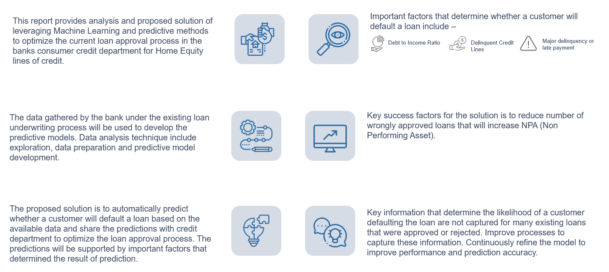
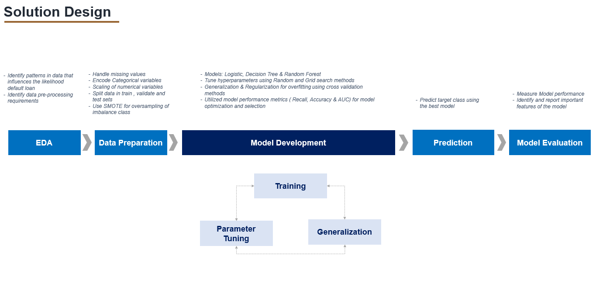
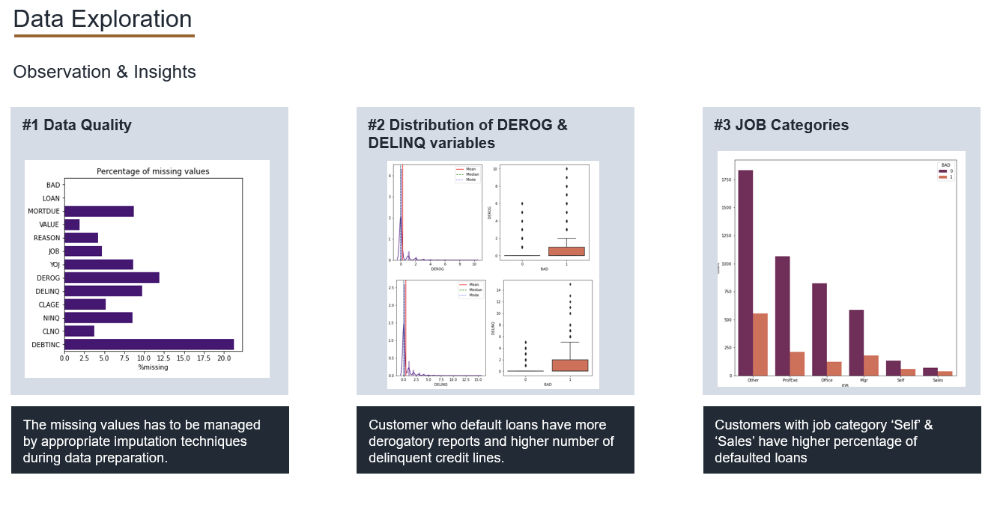
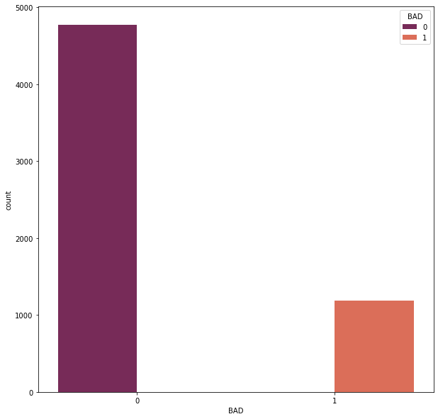
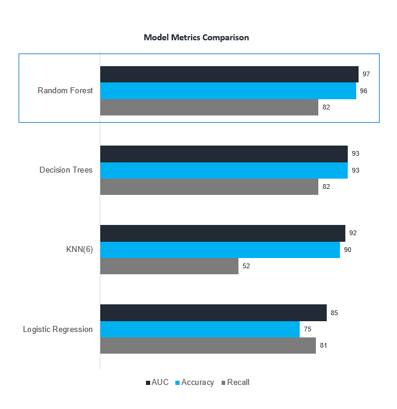
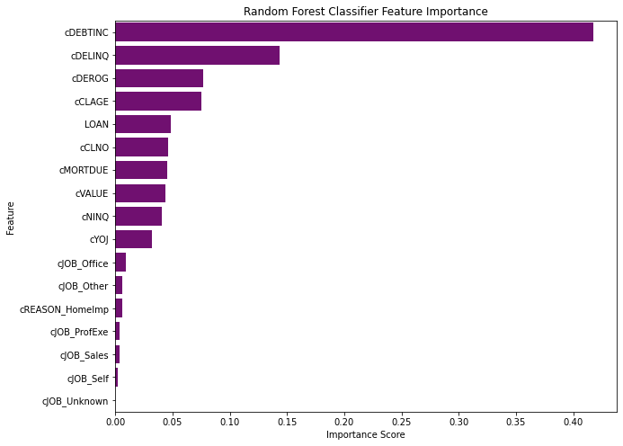

[Back to Projects](https://shouvikn.github.io/projects)

## Data Science Capstone Project

### Context
Major proportion of retail bank profit comes from interest in the form of home loans. These loans are borrowed by regular income/high earning customers. Banks are most fearful of defaulters, as bad loans (NPA) usually eat up a major chunk of their profits and it is highly vulnerable to defaulted loans.Therefore, it is important for banks to be judicious while approving the loans for the customer. The approval process for the loans is multifaceted. It tries to check the creditworthiness of the applicant on the basis of manual study of various aspects of the applicant. This whole process is not only effort intensive but also prone to wrong judgement/approval owing to human error and biases. There
have been attempts by many banks to automate this process by using heuristics. But with the advent of a lot of data and machine learning, the focus has shifted to building machines that can learn this approval process and make it free of biases as well as more efficient. At the same time, one important thing to keep in mind is to make sure when the machine learns, they have not learned the biases that previously came because of the human approval process.

A bank's consumer credit department aims to simplify the decision-making process for home equity lines of credit to be accepted. To do this they will adopt the Equal Credit Opportunity Act's guidelines to establish an empirically derived and statistically sound model for credit scoring. The model will be based on data obtained via the existing loan underwriting process from recent applicants who have been given credit. The model will be built from predictive modeling techniques, but the model created must be interpretable enough to provide a justification for any adverse behavior (rejections).

---

### Project Artifacts

#### [Project Report](https://github.com/shouvikn/dataprojects/blob/main/capstone/reports/LoanDefaultPrediction_ReportFinal_Shouvik.pdf)
#### [Notebook](https://nbviewer.org/github/shouvikn/dataprojects/blob/main/capstone/notebook/Capstone_Loans_Default_Prediction_Shouvik_V3.ipynb)

---

### Project Summary

---

### Solution Design

---

### EDA

**Observations**
- Many features have missing data points.
- Customers with default loans have higher number of derogatory reports and delinquent credit lines.
- Customers in Sales and Self job categories have higher percentatge of defaulted loans.

---

### Data Preparation

- Imputation of missing values from the data 
- Encoding of categorical variables
- Scale data to manage outliers

---

### Model Development

- Handled class imbalance problem using SMOTE, oversampling of minority class ( loan defaulted )

`smt = SMOTE(random_state=27, sampling_strategy = 0.4)`

`X_train_smt,y_train_smt = smt.fit_resample(X_train_s,y_train)`

- Explore RandomForest, Decision Trees, KNN & Logistic Regression
- Used GridSearch and RandomSearch techniques for hyperparameter tuning

After comparing model performance, RandomForest was selected as the best model for prediction

---

### Feature Importance

| Feature | Interpretation |
| -----   | ----   |
| Debt to Income Ratio | Customer have no funds for repaying debt |
| Number of Delinquent Credit Lines | Customer have history of defaulting loans |
| Number of Reported Delinquencies and/or Late Payments | Customer have history of defaulting loans with major issues and late payments |

---

### Recomendations

**Threshold Analysis**

- We can evaluate updating the threshold to evaluate improvement in Recall score, as its is important that we don’t approve a loan which has high probability of being defaulted.

**Risk & Challenges**

- The model is not evaluated on Out of time data. The training data contain many imputed information, this might introduce bias in the model.

**Implemenation Considerations**

- There are lot of missing data in this dataset. The model performance can be increased if the missing data are being captured for the new loans. 
- Pilot the model on production data in parallel with manual operation to evaluate model performance on actual data.
- Setup Data Engineering team to develop data pipelines required for Model implementation.
- Periodically review Model performance and optimize continuously.
- Explore new features which can improve model performance.
- Verify the recommended features with Credit Analysts to evaluate and gaps in model interpretation.

---

[Back to Projects](https://shouvikn.github.io/projects) 
 

