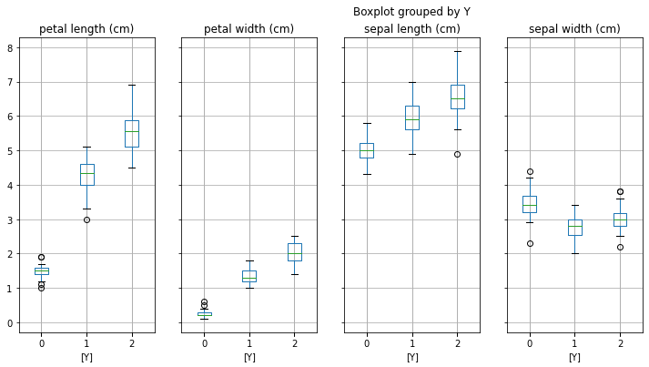

## My Data Science Projects

### [Project 1 : Unsupervised Learning - PCA & tSNE](https://github.com/shouvikn/dataprojects/blob/main/unsupervised_learn/Project%20PCA%20and%20tSNE.ipynb)
> Principal Component Analysis | tSNE | Exploratory Data Analysis

In this project we will explore dimensionality reduction using PCA & tSNE algorithm. We will be using the inbuilt Iris dataset from sklearn package. The data contains information about three types of Iris flower - Setosa, Versicolour & Virginica. For every type of flower there are four features sepal length, sepal width, petal length and petal width. 

- EDA to identify any patterns or correlation between features 
- Use PCA with 2 components to reduce dimensionality and visualize the data 
- Use tSNE with 2 components to reduce dimensionality and visualize the data
