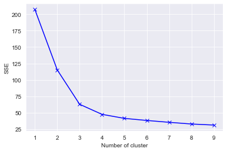
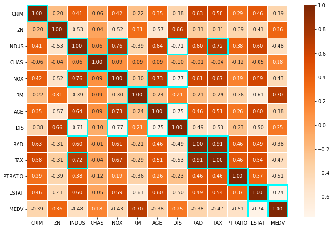

## Data Science Projects

### [Project 1 : Unsupervised Learning - PCA & tSNE](https://github.com/shouvikn/dataprojects/blob/main/unsupervised_learn/Project%20PCA%20and%20tSNE.ipynb)
> Principal Component Analysis - tSNE - Exploratory Data Analysis

In this project, we will explore dimensionality reduction using PCA & tSNE algorithm. We will be using the inbuilt Iris dataset from sklearn package. The data contains information about three types of Iris flower - Setosa, Versicolour & Virginica. For every type of flower there are four features sepal length, sepal width, petal length and petal width. 

- EDA to identify any patterns or correlation between features 
- Use PCA with 2 components to reduce dimensionality and visualize the data 
- Use tSNE with 2 components to reduce dimensionality and visualize the data

---

### [Project 2 : Segmentation of Bank customers using clustering techinques](https://nbviewer.org/github/shouvikn/dataprojects/blob/main/unsupervised_learn/Project_Unsupervised_Learning.ipynb)
> K-Means - DBSCAN - Gaussian Mixture Model

In this project, we will cluster customer data from a bank. The goal is to indentify various customer segments to run marketing campaigns. They have been advised by their marketing research team, that the penetration in the market can be improved. Based on this input, the Marketing team proposes to run personalised campaigns to target new customers as well as upsell to existing customers. Another insight from the market research was that the customers perceive the support services of the bank poorly. Based on this, the Operations team wants to upgrade the service delivery model, to ensure that customers queries are resolved faster.

- EDA to identify and clean data and determine patterns or correlation between features
- Data prepocessing to limit the impact of outliers in the data 
- Implement k-means, DBSCAN & GMM models to determine clusters 
- Compare the results of the 3 implemented models
- Recomend appropriate campaings for the idenitfied clusters

---

### [Project 3 : Predtion of Housing Prices](https://github.com/shouvikn/dataprojects/blob/main/machinelearning/Project_%20Linear%20Regression(Boston%20House%20Price)%20(1).ipynb)
> Linear Regression - Machine Learning - Model Metrics

In this project, we will predict the housing prices of a town or a suburb based on the features of the locality provided to us. In the process, we need to identify the most important features in the dataset. We need to employ techniques of data preprocessing and build a linear regression model that predicts the prices for us.Each record in the dataset describes a Boston suburb or town. The data was drawn from the Boston Standard Metropolitan Statistical Area (SMSA) in 1970.

- Statiscal analysis to determin skewness of features
- EDA to determine patterns and correlation between features
- Implementation of linear regression model to predict housing prices
- Feature selection using Variance Inflation Factor

---

